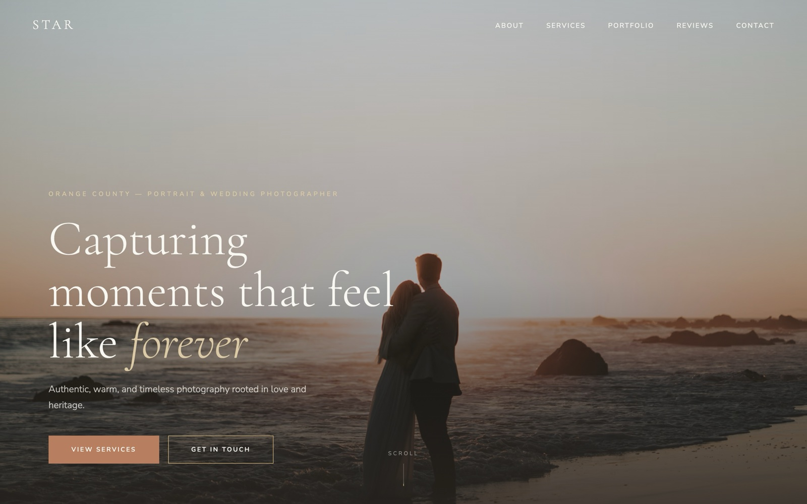
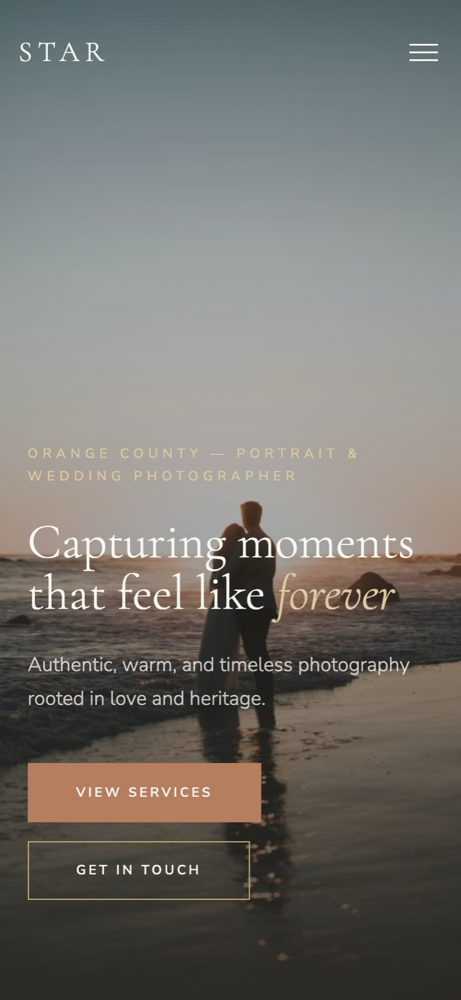
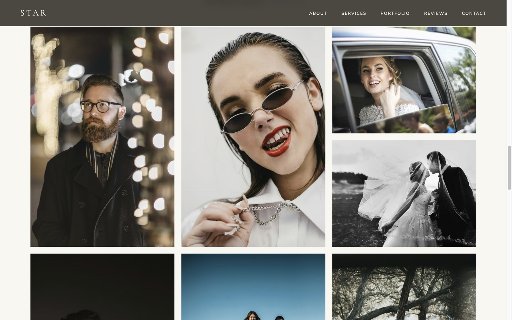
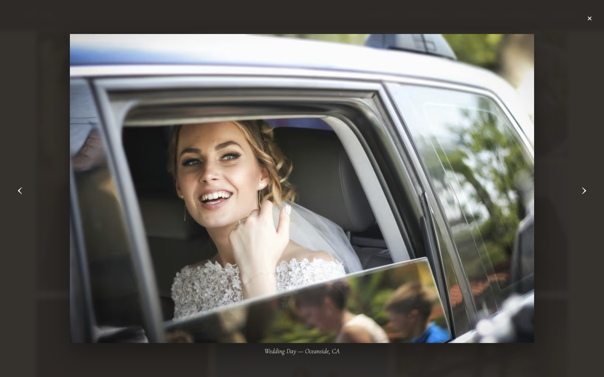

# Star Photography, LLC

A single-page marketing site for an Orange County–based portrait and wedding photographer. Built as a static site with vanilla HTML, CSS, and JavaScript — no frameworks, no build step.

**Live site:** [star-photography.netlify.app](https://star-photography.netlify.app)

> **Note:** This is a portfolio piece. The business, reviews, pricing, and social handles are fabricated. Contact details (phone, email, address) are fake but written to look realistic for a small Orange County photographer — the phone number uses the FCC-reserved `555-01XX` fictional range. The geography referenced (Orange County / Orange, California) is real.

## Screenshots

Home page — responsive across breakpoints:

<p align="center">
  
  &nbsp;&nbsp;
  
</p>

Portfolio gallery — masonry-style grid with dense flow:

<p align="center">
  
</p>

Accessible lightbox — keyboard navigation, focus trap, Escape to close:

<p align="center">
  
</p>

## Sections

- **Hero** — full-bleed image with responsive `srcset` and LCP preload
- **About** — photographer bio
- **Services** — Weddings, Portraits, Destinations
- **Portfolio** — masonry-style gallery that opens into a keyboard-accessible lightbox
- **Reviews** — client testimonials
- **Contact** — Netlify-powered form with honeypot spam protection

## Features

- Scroll-reveal animations via `IntersectionObserver`
- Accessible lightbox: focus trap, `Esc` to close, `←`/`→` to navigate
- Mobile menu with scroll lock and viewport-change handling
- `$100 off` discount popup triggered by time (30s), scroll depth (60%), or exit intent — with 7-day dismiss memory in `localStorage` and a second hidden Netlify form to capture emails
- Responsive Cloudinary images (`f_auto,q_auto` + width-based `srcset`) for fast LCP
- Contact and promo forms submit via `fetch` to Netlify without a page reload

## Engineering notes

A few decisions worth calling out:

- **No framework.** This is a marketing site — SEO, LCP, and bundle size matter more than component reuse. React or Vue would add a tax (bundle, hydration, build pipeline) that the UX doesn't need.
- **No build step.** The repo is deploy-ready as-is: push to `main`, Netlify serves the static files. Keeps the feedback loop tight and removes a class of breakage.
- **Vanilla JS, scoped by section.** Each interaction (reveal, lightbox, mobile menu, promo popup, contact form) is its own block with graceful fallbacks — `IntersectionObserver` capability check, `localStorage` try/catch, focus-trap guards.
- **Cloudinary for images.** `f_auto,q_auto` picks the best format (AVIF/WebP/JPG) per client, and `srcset` + `fetchpriority="high"` on the hero delivers the LCP image as a ~100 KB AVIF instead of a multi-MB JPG.
- **Netlify forms for submissions.** Contact and promo email capture land in the Netlify dashboard with zero backend code. Hidden form stubs register the schemas at build time.
- **Accessibility baked in.** Semantic landmarks (`<header>`, `<nav>`, `<main>`, named `<section>`s, `<footer>`), skip link to `<main>`, per-context `:focus-visible` rings tuned for WCAG 1.4.11 contrast, focus traps with restore on close in every modal, `aria-modal` / `aria-labelledby` / `aria-describedby`, polite `aria-live` regions for form status and lightbox caption changes, descriptive `aria-label`s on icon-only and otherwise-ambiguous links, `prefers-reduced-motion` respected across animations, reveal observer falls back to instant-show.

## Performance

Lighthouse (desktop), measured locally after the round-4 a11y pass:

| Performance | Accessibility | Best Practices | SEO |
| :---------: | :-----------: | :------------: | :-: |
|     100     |      100      |      100       | 100 |

_Production will refresh on next deploy. Re-run against production:_
`npx lighthouse https://star-photography.netlify.app --preset=desktop --view`

Key optimizations:

- Hero LCP image preloaded with responsive `srcset` and `fetchpriority="high"`
- Cloudinary `f_auto,q_auto` negotiates AVIF/WebP/JPG per client
- `<script defer>` so parsing doesn't block
- `loading="lazy"` on every below-the-fold image
- Single same-origin CSS file to minimize round-trips
- `prefers-reduced-motion` respected across animations

## Tech

- HTML / CSS / JavaScript (no dependencies)
- [Netlify](https://www.netlify.com/) — hosting + forms
- [Cloudinary](https://cloudinary.com/) — image CDN and transforms
- [Google Fonts](https://fonts.google.com/) — Cormorant Garamond + Nunito Sans

## Project structure

```
.
├── index.html        # markup for every section
├── scripts.js        # preloader, nav, reveal, lightbox, forms, promo
├── favicon.svg       # inline gold-star favicon
├── css/
│   └── styles.css    # all styles
└── screenshots/      # README images
```

## Local development

No build step. Serve the directory with any static server, e.g.:

```bash
npx serve .
```

Or use the Netlify CLI to test forms locally:

```bash
netlify dev
```

## Deployment

Pushes to `main` auto-deploy to Netlify. Both `contact` and `promo` forms are registered at build time via the `data-netlify="true"` attributes on the hidden form stubs in [index.html](index.html).
